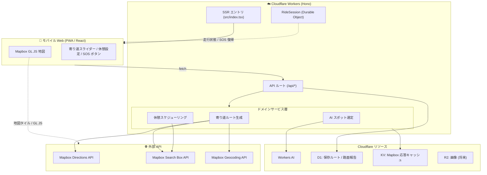
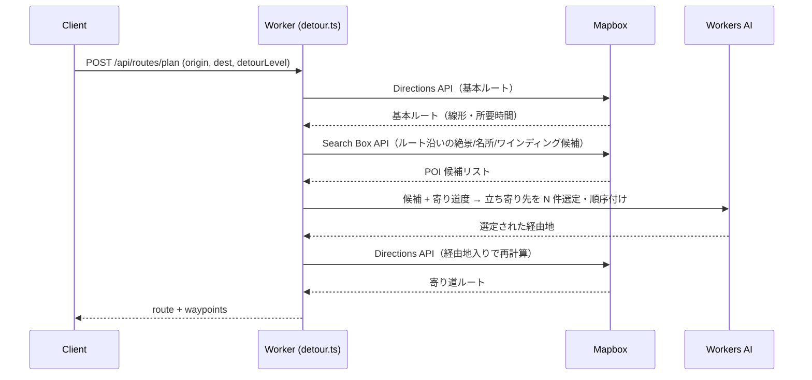
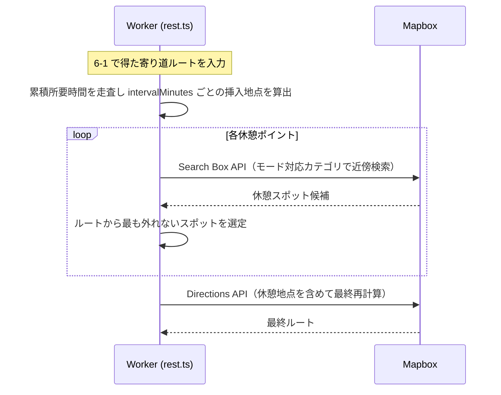

# ブラブライダー（Buraburider）アーキテクチャ設計書

「最高の道中」を提案するバイク乗り向け体験特化型ナビ **ブラブライダー（Buraburider）** を、Cloudflare プラットフォーム上の Web アプリとして実装するための設計をまとめる。

> 段階的な実装ステップは [implementation-plan.md](./implementation-plan.md) を参照。

## 1. スコープ（ハッカソン版）

[product-vision.md](./product-vision.md) の 4 機能のうち、デモで体験価値が最も伝わる次の 2 つをコアとして実装する。

| # | 機能 | 本設計での扱い |
|---|------|----------------|
| ① | ルート生成＆カスタマイズ（寄り道度スライダー） | **フル実装**（コア） |
| ② | スマート休憩スケジューリング（モード選択） | **フル実装**（コア） |
| ③ | 安全・快適ルーティング（酷道・悪路回避） | 土台のみ（ユーザー報告のスキーマと回避フィルタの差し込み口を用意。プローブ解析は対象外） |
| ④ | 走行中の緊急アクション（SOS ボタン） | UI と走行セッション DO の土台のみ（自動復帰ロジックは対象外） |

### 技術選定

| 領域 | 採用 | 備考 |
|------|------|------|
| 実行基盤 | **Cloudflare Workers**（Hono） | 既存スターターの SSR + API 構成を踏襲 |
| フロント | **React 19 + Vite SSR** | 既存構成。地図は Mapbox GL JS |
| 地図・ルーティング・POI | **Mapbox** | GL JS / Directions API / Search Box API |
| LLM | **Workers AI** | 寄り道スポットの選定・並べ替えに利用 |
| 状態・永続化 | **Durable Objects / D1 / KV / R2** | 用途別に使い分け（後述） |
| 形態 | **モバイル Web（PWA）** | Geolocation・全画面ナビ UI・SOS のグローブ操作を意識 |

## 2. システム全体構成



### 責務の分離方針

- **Mapbox のシークレットトークンは Worker 側だけが保持**し、Directions / Search / Geocoding はすべて Worker がプロキシする。フロントには地図表示（GL JS）用の public token のみを渡す。
  - これにより従量課金の暴発防止・キャッシュ・リトライ・レート制御を Worker に集約できる。
- 地図タイルの描画（GL JS）はブラウザから Mapbox に直接アクセスする（プロキシしない）。

## 3. ディレクトリ構成

```
src/
  index.tsx                  # Hono アプリのエントリ（SSR + /api マウント）
  server/
    routes/
      plan.ts                # POST /api/routes/plan  ルート生成の入口
      search.ts              # GET  /api/search/suggest 目的地サジェスト(Geocoding proxy)
      reports.ts             # POST /api/reports 路面報告（③ の土台）
    services/
      mapbox.ts              # Mapbox APIクライアント（Directions/Search/Geocoding + KVキャッシュ）
      detour.ts              # 寄り道ルート生成のオーケストレーション
      rest.ts                # 休憩スケジューリングのロジック
      ai.ts                  # Workers AI でスポット選定・並べ替え
      avoidance.ts           # 酷道・悪路回避フィルタ（③ の差し込み口）
    types.ts                 # 共有ドメイン型（Route, Waypoint, Spot, ...）
  agents/
    ride-session.ts          # RideSession Durable Object（④ の土台、Agents SDK）
  client/
    index.tsx                # クライアントエントリ（hydration）
    app.tsx                  # 画面ルート
    components/
      MapView.tsx            # Mapbox GL JS でルート・スポット描画
      DetourSlider.tsx       # 寄り道度スライダー
      RestSettings.tsx       # 休憩間隔・モード選択
      SosButton.tsx          # 常時固定 SOS ボタン（スワイプ/長押し）
      RoutePanel.tsx         # 生成結果（距離・時間・立ち寄り一覧）
    hooks/
      useGeolocation.ts      # 現在地取得
      useRoutePlan.ts        # /api/routes/plan 呼び出し
  style.css
public/
  manifest.webmanifest       # PWA マニフェスト
  icons/                     # PWA アイコン
```

既存の `src/agents/counter.ts` と `src/client/counter.tsx` はサンプルなので、実装着手時に削除または `ride-session.ts` へ置き換える。

## 4. データモデルとリソースの使い分け

| リソース | 用途 | 補足 |
|----------|------|------|
| **Durable Objects** (`RideSession`) | 走行中セッションの状態（現在ルート・進捗・SOS 前の元ルート） | Agents SDK ベース。④ の自動復帰の土台。1 ライド = 1 インスタンス |
| **D1** (`BURABURIDER_DB`) | 保存したルート、路面報告（砂利/落ち葉/凍結） | ③ の回避フィルタが参照。ハッカソンでは報告投稿と一覧まで |
| **KV** (`CACHE`) | Mapbox Geocoding / Search の応答キャッシュ | キーは正規化クエリ。TTL で従量課金と遅延を削減 |
| **R2** (`ASSETS`) | 絶景ポイントの写真など（将来） | 今回は未使用、バインディングのみ確保可 |
| **Workers AI** (`AI`) | 寄り道スポットの選定・並べ替え | モデルは軽量な指示追従モデルを想定 |

### D1 スキーマ（初期案）

```sql
-- 路面報告（③ の土台）
CREATE TABLE road_reports (
  id          TEXT PRIMARY KEY,
  lng         REAL NOT NULL,
  lat         REAL NOT NULL,
  hazard      TEXT NOT NULL,        -- 'gravel' | 'leaves' | 'ice'
  reported_at INTEGER NOT NULL      -- epoch ms
);

-- 保存ルート
CREATE TABLE saved_routes (
  id         TEXT PRIMARY KEY,
  name       TEXT,
  origin     TEXT NOT NULL,         -- JSON [lng, lat]
  dest       TEXT NOT NULL,         -- JSON [lng, lat]
  geojson    TEXT NOT NULL,         -- ルート GeoJSON
  created_at INTEGER NOT NULL
);
```

## 5. API 設計

すべて Worker（Hono）が受け、Mapbox へはサーバー側で問い合わせる。

### `POST /api/routes/plan` — ルート生成（①＋②の中核）

リクエスト:

```jsonc
{
  "origin": [139.767, 35.681],       // [lng, lat]
  "destination": [138.727, 35.360],  // 例: 富士山方面
  "detourLevel": 3,                  // 0〜5（寄り道度スライダー）
  "rest": {
    "enabled": true,
    "intervalMinutes": 90,           // 「1時間半ごと」
    "mode": "local"                  // 'konbini' | 'local' | 'cafe' | 'emergency'
  }
}
```

レスポンス:

```jsonc
{
  "route": { "geojson": { /* LineString */ }, "distanceKm": 152.4, "durationMin": 214 },
  "waypoints": [ { "type": "scenic", "name": "○○峠展望台", "coord": [/* ... */] } ],
  "rests":     [ { "type": "michinoeki", "name": "道の駅△△", "atMinute": 88, "coord": [/* ... */] } ]
}
```

### `GET /api/search/suggest?q=...` — 目的地サジェスト

Mapbox Geocoding をプロキシしてオートコンプリート候補を返す（KV キャッシュ）。

### `POST /api/reports` — 路面報告（③ の土台）

砂利・落ち葉・凍結の報告を D1 に保存。

## 6. 主要フロー

### 6-1. 寄り道ルート生成



- **寄り道度スライダー**は「挿入する経由地の数」「基本ルートからの許容遠回り率」にマッピングする（例: level 0 = 経由地なし、level 5 = 最大 5〜6 スポット/遠回り率上限を緩和）。
- **AI の役割**は「候補 POI と寄り道度を渡し、道中体験が最大化される順路を選ばせる」こと。候補が空/AI 失敗時はスコアリング（ルートからの距離・カテゴリ重み）でフォールバックする。

### 6-2. 休憩スケジューリング



**モード → Mapbox 検索カテゴリのマッピング:**

| モード | 優先カテゴリ |
|--------|--------------|
| サクッと休憩 (`konbini`) | convenience store |
| ご当地満喫 (`local`) | 道の駅 / 特産品・farmers market |
| 絶景・ライダーズカフェ (`cafe`) | cafe / scenic viewpoint |
| 緊急ピットイン (`emergency`) | gas station / 屋内施設 |

## 7. Cloudflare バインディング（wrangler.jsonc 追記案）

```jsonc
{
  "name": "buraburider",
  "main": "src/index.tsx",
  "compatibility_date": "2026-06-14",
  "compatibility_flags": ["nodejs_compat"],
  "ai": { "binding": "AI" },
  "durable_objects": {
    "bindings": [{ "name": "RideSession", "class_name": "RideSession" }]
  },
  "migrations": [
    { "tag": "v1", "new_sqlite_classes": ["RideSession"] }
  ],
  "d1_databases": [
    { "binding": "BURABURIDER_DB", "database_name": "buraburider", "database_id": "<id>" }
  ],
  "kv_namespaces": [
    { "binding": "CACHE", "id": "<id>" }
  ],
  "vars": {
    "MAPBOX_PUBLIC_TOKEN": "pk...."   // フロント配布用 public token
  }
  // MAPBOX_SECRET_TOKEN は `wrangler secret put` で登録（サーバー専用）
}
```

- **`MAPBOX_SECRET_TOKEN`** はシークレット（`wrangler secret put`）で管理し、コードにも public な設定にも出さない。
- `MAPBOX_PUBLIC_TOKEN` は GL JS の地図描画に必要なため、SSR 時に安全にフロントへ埋め込む。

## 8. PWA / モバイル対応

- `public/manifest.webmanifest` と Service Worker（オフライン地図までは踏み込まず、インストール可能性とアプリ体験を確保）。
- **Geolocation API** で現在地を出発地の初期値に。
- **全画面ナビ UI**: 地図を全面に敷き、UI（スライダー・パネル・SOS）はオーバーレイ。
- **SOS ボタン**: 画面端に透過の大サイズで常時固定。誤作動防止のため「スワイプ / 1 秒長押し」で発動（ロジックは土台のみ）。

## 9. データ精度の検証結果

### 道の駅データ（2026-08-08 検証）

`scripts/verify-michinoeki.mjs` により、山梨県周辺（BBox `[35.15, 138.2, 35.95, 139.15]`）で
OSM（Overpass）を基準に Mapbox Search Box API のカバー率を測定した。

- OSM 基準件数: 37 件 / Mapbox 一致: 30 件 / **カバー率 81.1%**
- 未一致 7 件のうち 6 件は「道の駅○○入口/前」等のバス停・付帯施設ノイズ（真の道の駅ではない）。
  実質の取りこぼしは「道の駅みのぶ」1 件のみで、**実質カバー率は約 90% 以上**。

**結論: 道の駅 POI は Mapbox Search Box API 単独で賄える。** OSM/Overpass によるハイブリッド補完は
MVP では不要とする（外部依存を Mapbox のみに保てる）。将来的に取りこぼしが問題化した場合の
補完先として OSM を候補に残す。
